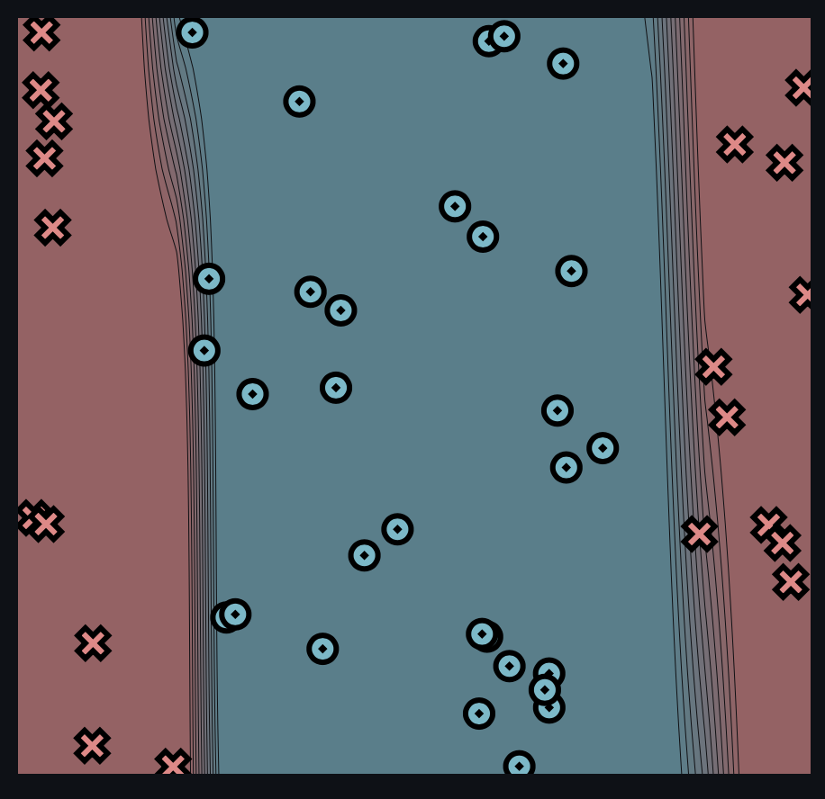

[](https://classroom.github.com/a/YFgwt0yY)

# MiniTorch Module 2


- Docs: https://minitorch.github.io/

- Overview: https://minitorch.github.io/module2/module2/

This assignment requires the following files from the previous assignments. You can get these by running

```bash
python sync_previous_module.py previous-module-dir current-module-dir
```

The files that will be synced are:

        minitorch/operators.py minitorch/module.py minitorch/autodiff.py minitorch/scalar.py minitorch/scalar_functions.py minitorch/module.py project/run_manual.py project/run_scalar.py project/datasets.py

TASK 2.5 model training

# Simple Dataset

50pts

hidden layer size = 2

learning rate = 0.5

number of epochs = 500

time per epoch = 0.082s


Training log

Epoch: 0/500, loss: 0, correct: 0

Epoch: 10/500, loss: 33.26170393472413, correct: 23

Epoch: 20/500, loss: 32.723788979393646, correct: 38

Epoch: 30/500, loss: 32.18016412143247, correct: 40

Epoch: 40/500, loss: 31.582900185256488, correct: 40

Epoch: 50/500, loss: 30.898385142389298, correct: 42

Epoch: 60/500, loss: 30.11676552786614, correct: 43

Epoch: 70/500, loss: 29.20320675768264, correct: 44

Epoch: 80/500, loss: 28.146797556176807, correct: 44

Epoch: 90/500, loss: 26.937265098081973, correct: 45

Epoch: 100/500, loss: 25.6124083713099, correct: 45

Epoch: 110/500, loss: 24.19363312385432, correct: 46

Epoch: 120/500, loss: 22.690710828888715, correct: 47

Epoch: 130/500, loss: 21.206064251318566, correct: 47

Epoch: 140/500, loss: 19.815655644362753, correct: 48

Epoch: 150/500, loss: 18.494035118449695, correct: 48

Epoch: 160/500, loss: 17.21724862131101, correct: 48

Epoch: 170/500, loss: 16.010438142068843, correct: 48

Epoch: 180/500, loss: 14.907366436135318, correct: 48

Epoch: 190/500, loss: 13.881953638144282, correct: 48

Epoch: 200/500, loss: 12.985763590682472, correct: 48

Epoch: 210/500, loss: 12.16920773417702, correct: 48

Epoch: 220/500, loss: 11.423524390222545, correct: 49

Epoch: 230/500, loss: 10.748520331108, correct: 49

Epoch: 240/500, loss: 10.137127365833237, correct: 50

Epoch: 250/500, loss: 9.590854135843808, correct: 50

Epoch: 260/500, loss: 9.102665335738832, correct: 50

Epoch: 270/500, loss: 8.657436153674688, correct: 50

Epoch: 280/500, loss: 8.252776702595884, correct: 50

Epoch: 290/500, loss: 7.889372714932887, correct: 50

Epoch: 300/500, loss: 7.559357056618553, correct: 50

Epoch: 310/500, loss: 7.260518931333484, correct: 50

Epoch: 320/500, loss: 6.986615315773835, correct: 50

Epoch: 330/500, loss: 6.735423854212838, correct: 50

Epoch: 340/500, loss: 6.503298525206376, correct: 50

Epoch: 350/500, loss: 6.286796375779319, correct: 50

Epoch: 360/500, loss: 6.0840286690618735, correct: 50

Epoch: 370/500, loss: 5.893871001968216, correct: 50

Epoch: 380/500, loss: 5.715497830263148, correct: 50

Epoch: 390/500, loss: 5.547523486981076, correct: 50

Epoch: 400/500, loss: 5.388916068734173, correct: 50

Epoch: 410/500, loss: 5.238862961519726, correct: 50

Epoch: 420/500, loss: 5.096844631788487, correct: 50

Epoch: 430/500, loss: 4.9621764396619, correct: 50

Epoch: 440/500, loss: 4.834100459753329, correct: 50

Epoch: 450/500, loss: 4.712108040780209, correct: 50

Epoch: 460/500, loss: 4.5957431372938125, correct: 50

Epoch: 470/500, loss: 4.484598111791747, correct: 50

Epoch: 480/500, loss: 4.378301313338874, correct: 50

Epoch: 490/500, loss: 4.2766001884892875, correct: 50

Epoch: 500/500, loss: 4.179442498881079, correct: 50

# Diag Dataset

50pts

hidden layer size = 2

learning rate = 0.5

number of epochs = 500

time per epoch = 0.081s


Training log

Epoch: 0/500, loss: 0, correct: 0

Epoch: 10/500, loss: 14.79689239884395, correct: 45

Epoch: 20/500, loss: 14.062141364038437, correct: 45

Epoch: 30/500, loss: 13.23154838085668, correct: 45

Epoch: 40/500, loss: 12.026205663905039, correct: 45

Epoch: 50/500, loss: 10.276942553972413, correct: 45

Epoch: 60/500, loss: 8.240242826154146, correct: 45

Epoch: 70/500, loss: 6.270530136389896, correct: 47

Epoch: 80/500, loss: 5.048811841778752, correct: 48

Epoch: 90/500, loss: 4.165119065621084, correct: 48

Epoch: 100/500, loss: 3.4331462963780717, correct: 49

Epoch: 110/500, loss: 2.843333054869962, correct: 49

Epoch: 120/500, loss: 2.375315391481273, correct: 50

Epoch: 130/500, loss: 2.0051622940573632, correct: 50

Epoch: 140/500, loss: 1.7109457859294488, correct: 50

Epoch: 150/500, loss: 1.4749797983823252, correct: 50

Epoch: 160/500, loss: 1.28374634159188, correct: 50

Epoch: 170/500, loss: 1.1271100120400548, correct: 50

Epoch: 180/500, loss: 0.9974908619376882, correct: 50

Epoch: 190/500, loss: 0.8891899626826353, correct: 50

Epoch: 200/500, loss: 0.7978851096203274, correct: 50

Epoch: 210/500, loss: 0.7202654132034858, correct: 50

Epoch: 220/500, loss: 0.653768714316633, correct: 50

Epoch: 230/500, loss: 0.5963924605640659, correct: 50

Epoch: 240/500, loss: 0.5465565333596979, correct: 50

Epoch: 250/500, loss: 0.5030028560514933, correct: 50

Epoch: 260/500, loss: 0.46472120546512136, correct: 50

Epoch: 270/500, loss: 0.430893853801045, correct: 50

Epoch: 280/500, loss: 0.40085386912899035, correct: 50

Epoch: 290/500, loss: 0.37405341768883926, correct: 50

Epoch: 300/500, loss: 0.3500394601442505, correct: 50

Epoch: 310/500, loss: 0.32843496263461497, correct: 50

Epoch: 320/500, loss: 0.30919367256737473, correct: 50

Epoch: 330/500, loss: 0.29202343518055784, correct: 50

Epoch: 340/500, loss: 0.2765420103361576, correct: 50

Epoch: 350/500, loss: 0.2624257729002578, correct: 50

Epoch: 360/500, loss: 0.24945761462131028, correct: 50

Epoch: 370/500, loss: 0.23751176469305688, correct: 50

Epoch: 380/500, loss: 0.22647978632181928, correct: 50

Epoch: 390/500, loss: 0.21626766277043094, correct: 50

Epoch: 400/500, loss: 0.20679348354455146, correct: 50

Epoch: 410/500, loss: 0.19798556706774217, correct: 50

Epoch: 420/500, loss: 0.18978092512809727, correct: 50

Epoch: 430/500, loss: 0.182123997543938, correct: 50

Epoch: 440/500, loss: 0.17496560239717152, correct: 50

Epoch: 450/500, loss: 0.168262059660239, correct: 50

Epoch: 460/500, loss: 0.1619744553618858, correct: 50

Epoch: 470/500, loss: 0.15606802044743456, correct: 50

Epoch: 480/500, loss: 0.15051160389038346, correct: 50

Epoch: 490/500, loss: 0.14527722368724205, correct: 50

Epoch: 500/500, loss: 0.1403396825800545, correct: 50

# Split Dataset

50pts

hidden layer size = 5

learning rate = 0.5

number of epochs = 1200

time per epoch = 0.246s




Training log

Epoch: 0/1200, loss: 0, correct: 0

Epoch: 10/1200, loss: 32.995697664490415, correct: 30

Epoch: 20/1200, loss: 32.713970607158686, correct: 30

Epoch: 30/1200, loss: 32.32850005570553, correct: 30

Epoch: 40/1200, loss: 31.76793030155799, correct: 30

Epoch: 50/1200, loss: 31.017574744765774, correct: 37

Epoch: 60/1200, loss: 30.13254858296639, correct: 39

Epoch: 70/1200, loss: 28.739932120003033, correct: 39

Epoch: 80/1200, loss: 27.19557921688387, correct: 40

Epoch: 90/1200, loss: 25.359052276072365, correct: 40

Epoch: 100/1200, loss: 23.597831630795135, correct: 40

Epoch: 110/1200, loss: 22.1174117631619, correct: 40

Epoch: 120/1200, loss: 21.471703698772036, correct: 40

Epoch: 130/1200, loss: 20.67793676177082, correct: 40

Epoch: 140/1200, loss: 19.747077081108305, correct: 40

Epoch: 150/1200, loss: 19.607821227500033, correct: 40

Epoch: 160/1200, loss: 19.12152620660766, correct: 39

Epoch: 170/1200, loss: 22.484080938808177, correct: 35

Epoch: 180/1200, loss: 21.85303017696552, correct: 36

Epoch: 190/1200, loss: 14.32801373787015, correct: 40

Epoch: 200/1200, loss: 23.314672467014738, correct: 35

Epoch: 210/1200, loss: 9.404235362660165, correct: 47

Epoch: 220/1200, loss: 17.072764068526723, correct: 40

Epoch: 230/1200, loss: 7.905878854660539, correct: 50

Epoch: 240/1200, loss: 7.895094081688613, correct: 48

Epoch: 250/1200, loss: 35.521571836222634, correct: 32

Epoch: 260/1200, loss: 5.751307801289079, correct: 50

Epoch: 270/1200, loss: 5.561915366685358, correct: 49

Epoch: 280/1200, loss: 40.3767243480303, correct: 35

Epoch: 290/1200, loss: 4.982747623614749, correct: 50

Epoch: 300/1200, loss: 4.9409983369415444, correct: 49

Epoch: 310/1200, loss: 32.60598994644546, correct: 35

Epoch: 320/1200, loss: 4.012313032563663, correct: 50

Epoch: 330/1200, loss: 3.3978430812576668, correct: 50

Epoch: 340/1200, loss: 3.0388135712900315, correct: 50

Epoch: 350/1200, loss: 2.7479751868801525, correct: 50

Epoch: 360/1200, loss: 2.509596395260194, correct: 50

Epoch: 370/1200, loss: 2.3023687634008594, correct: 50

Epoch: 380/1200, loss: 2.1260854512527065, correct: 50

Epoch: 390/1200, loss: 1.9746648001499019, correct: 50

Epoch: 400/1200, loss: 1.8427274715287418, correct: 50

Epoch: 410/1200, loss: 1.726526013562783, correct: 50

Epoch: 420/1200, loss: 1.6233581728174113, correct: 50

Epoch: 430/1200, loss: 1.5311626290126337, correct: 50

Epoch: 440/1200, loss: 1.4483016890139513, correct: 50

Epoch: 450/1200, loss: 1.3734475777306394, correct: 50

Epoch: 460/1200, loss: 1.3055112732396073, correct: 50

Epoch: 470/1200, loss: 1.2435912752851217, correct: 50

Epoch: 480/1200, loss: 1.186935093486933, correct: 50

Epoch: 490/1200, loss: 1.134909822057946, correct: 50

Epoch: 500/1200, loss: 1.0869793971787647, correct: 50

Epoch: 510/1200, loss: 1.0426868364986712, correct: 50

Epoch: 520/1200, loss: 1.0016402361318375, correct: 50

Epoch: 530/1200, loss: 0.9635016319189336, correct: 50

Epoch: 540/1200, loss: 0.9279780657994711, correct: 50

Epoch: 550/1200, loss: 0.8948143655646094, correct: 50

Epoch: 560/1200, loss: 0.8637872674240576, correct: 50

Epoch: 570/1200, loss: 0.8347005994721313, correct: 50

Epoch: 580/1200, loss: 0.8073813096701922, correct: 50

Epoch: 590/1200, loss: 0.781676184014893, correct: 50

Epoch: 600/1200, loss: 0.7574493577242655, correct: 50

Epoch: 610/1200, loss: 0.7345791191062131, correct: 50

Epoch: 620/1200, loss: 0.7129569193598351, correct: 50

Epoch: 630/1200, loss: 0.6924853950755444, correct: 50

Epoch: 640/1200, loss: 0.6730769694583403, correct: 50

Epoch: 650/1200, loss: 0.654652657881178, correct: 50

Epoch: 660/1200, loss: 0.6371410437784738, correct: 50

Epoch: 670/1200, loss: 0.6204773972457969, correct: 50

Epoch: 680/1200, loss: 0.6046029137123766, correct: 50

Epoch: 690/1200, loss: 0.5894640540590845, correct: 50

Epoch: 700/1200, loss: 0.5750119707808774, correct: 50

Epoch: 710/1200, loss: 0.5612020074046375, correct: 50

Epoch: 720/1200, loss: 0.5479932604976827, correct: 50

Epoch: 730/1200, loss: 0.5353481953382231, correct: 50

Epoch: 740/1200, loss: 0.5232323077437828, correct: 50

Epoch: 750/1200, loss: 0.5116138257278431, correct: 50

Epoch: 760/1200, loss: 0.5004634456267322, correct: 50

Epoch: 770/1200, loss: 0.4897540981459356, correct: 50

Epoch: 780/1200, loss: 0.47946074044815074, correct: 50

Epoch: 790/1200, loss: 0.46956017096861014, correct: 50

Epoch: 800/1200, loss: 0.46003086411609945, correct: 50

Epoch: 810/1200, loss: 0.45085282241652724, correct: 50

Epoch: 820/1200, loss: 0.4420074439926497, correct: 50

Epoch: 830/1200, loss: 0.4334774035589057, correct: 50

Epoch: 840/1200, loss: 0.42524654535309897, correct: 50

Epoch: 850/1200, loss: 0.4172997866335394, correct: 50

Epoch: 860/1200, loss: 0.40962303054719845, correct: 50

Epoch: 870/1200, loss: 0.4022030873261379, correct: 50

Epoch: 880/1200, loss: 0.39502760289978284, correct: 50

Epoch: 890/1200, loss: 0.38808499412303865, correct: 50

Epoch: 900/1200, loss: 0.381364389917152, correct: 50

Epoch: 910/1200, loss: 0.3748555777043182, correct: 50

Epoch: 920/1200, loss: 0.36854895458987186, correct: 50

Epoch: 930/1200, loss: 0.36243548280926274, correct: 50

Epoch: 940/1200, loss: 0.3565066836324191, correct: 50

Epoch: 950/1200, loss: 0.35075451975759847, correct: 50

Epoch: 960/1200, loss: 0.3451713898037406, correct: 50

Epoch: 970/1200, loss: 0.3397501426048613, correct: 50

Epoch: 980/1200, loss: 0.3344840199204202, correct: 50

Epoch: 990/1200, loss: 0.32936662998401905, correct: 50

Epoch: 1000/1200, loss: 0.3243919231545239, correct: 50

Epoch: 1010/1200, loss: 0.3195541694761295, correct: 50

Epoch: 1020/1200, loss: 0.3148479379751554, correct: 50

Epoch: 1030/1200, loss: 0.31026807753916386, correct: 50

Epoch: 1040/1200, loss: 0.30580969923937706, correct: 50

Epoch: 1050/1200, loss: 0.3014681599711591, correct: 50

Epoch: 1060/1200, loss: 0.29723904729956213, correct: 50

Epoch: 1070/1200, loss: 0.2931181654079342, correct: 50

Epoch: 1080/1200, loss: 0.289101522057203, correct: 50

Epoch: 1090/1200, loss: 0.2851853164722638, correct: 50

Epoch: 1100/1200, loss: 0.28136592807966737, correct: 50

Epoch: 1110/1200, loss: 0.2776399060277834, correct: 50

Epoch: 1120/1200, loss: 0.27400395942691186, correct: 50

Epoch: 1130/1200, loss: 0.2704549482524136, correct: 50

Epoch: 1140/1200, loss: 0.2669898748590702, correct: 50

Epoch: 1150/1200, loss: 0.26360587605940505, correct: 50

Epoch: 1160/1200, loss: 0.2603002157227932, correct: 50

Epoch: 1170/1200, loss: 0.25707027785602404, correct: 50

Epoch: 1180/1200, loss: 0.2539135601291994, correct: 50

Epoch: 1190/1200, loss: 0.25082766781403226, correct: 50

Epoch: 1200/1200, loss: 0.2478103081042448, correct: 50

# Xor Dataset

50pts

hidden layer size = 8

learning rate = 0.1

number of epochs = 1000

time per epoch = 0.230s


Training log

Epoch: 0/1000, loss: 0, correct: 0

Epoch: 10/1000, loss: 29.04990184931118, correct: 38

Epoch: 20/1000, loss: 27.748301060099458, correct: 39

Epoch: 30/1000, loss: 27.002201233579708, correct: 40

Epoch: 40/1000, loss: 26.492608737491615, correct: 40

Epoch: 50/1000, loss: 26.044932752270068, correct: 39

Epoch: 60/1000, loss: 25.599641537491227, correct: 39

Epoch: 70/1000, loss: 25.171092989304327, correct: 39

Epoch: 80/1000, loss: 24.732371283891425, correct: 39

Epoch: 90/1000, loss: 24.285086222445695, correct: 41

Epoch: 100/1000, loss: 23.838711066841494, correct: 41

Epoch: 110/1000, loss: 23.397027770987396, correct: 41

Epoch: 120/1000, loss: 22.953804899570997, correct: 41

Epoch: 130/1000, loss: 22.5023225327047, correct: 41

Epoch: 140/1000, loss: 22.04419272999268, correct: 41

Epoch: 150/1000, loss: 21.57532488276169, correct: 41

Epoch: 160/1000, loss: 21.101959384238814, correct: 41

Epoch: 170/1000, loss: 20.623442058496053, correct: 41

Epoch: 180/1000, loss: 20.14598492885229, correct: 41

Epoch: 190/1000, loss: 19.652308469861307, correct: 41

Epoch: 200/1000, loss: 19.157725303952514, correct: 41

Epoch: 210/1000, loss: 18.6473972317519, correct: 41

Epoch: 220/1000, loss: 18.133089662479513, correct: 41

Epoch: 230/1000, loss: 17.60513900178066, correct: 41

Epoch: 240/1000, loss: 17.07077609233652, correct: 41

Epoch: 250/1000, loss: 16.537959214582617, correct: 41

Epoch: 260/1000, loss: 15.997056410225168, correct: 42

Epoch: 270/1000, loss: 15.454205765185757, correct: 43

Epoch: 280/1000, loss: 14.913522500600763, correct: 43

Epoch: 290/1000, loss: 14.372165143341217, correct: 45

Epoch: 300/1000, loss: 13.840644018335524, correct: 45

Epoch: 310/1000, loss: 13.319635562089623, correct: 46

Epoch: 320/1000, loss: 12.814755316597282, correct: 46

Epoch: 330/1000, loss: 12.325347427586678, correct: 47

Epoch: 340/1000, loss: 11.859946716307876, correct: 47

Epoch: 350/1000, loss: 11.41497329174949, correct: 47

Epoch: 360/1000, loss: 10.994679157707006, correct: 47

Epoch: 370/1000, loss: 10.599874390789656, correct: 47

Epoch: 380/1000, loss: 10.229545330772915, correct: 47

Epoch: 390/1000, loss: 9.888699230861866, correct: 47

Epoch: 400/1000, loss: 9.569753336557426, correct: 47

Epoch: 410/1000, loss: 9.26411235547164, correct: 47

Epoch: 420/1000, loss: 8.978901596716042, correct: 47

Epoch: 430/1000, loss: 8.709724555572986, correct: 47

Epoch: 440/1000, loss: 8.452839571222365, correct: 47

Epoch: 450/1000, loss: 8.20718843543301, correct: 47

Epoch: 460/1000, loss: 7.977601986334846, correct: 47

Epoch: 470/1000, loss: 7.75891355323576, correct: 47

Epoch: 480/1000, loss: 7.554984191820439, correct: 47

Epoch: 490/1000, loss: 7.359991208247256, correct: 47

Epoch: 500/1000, loss: 7.173286053487862, correct: 47

Epoch: 510/1000, loss: 6.996578965404191, correct: 48

Epoch: 520/1000, loss: 6.827469089293915, correct: 48

Epoch: 530/1000, loss: 6.668086129019906, correct: 48

Epoch: 540/1000, loss: 6.514813459594946, correct: 48

Epoch: 550/1000, loss: 6.367595004817262, correct: 48

Epoch: 560/1000, loss: 6.225546019603935, correct: 48

Epoch: 570/1000, loss: 6.089555056558882, correct: 49

Epoch: 580/1000, loss: 5.957605616349191, correct: 49

Epoch: 590/1000, loss: 5.831191182720676, correct: 49

Epoch: 600/1000, loss: 5.709762759469533, correct: 49

Epoch: 610/1000, loss: 5.592495261121473, correct: 49

Epoch: 620/1000, loss: 5.4786997353001405, correct: 49

Epoch: 630/1000, loss: 5.370153548142379, correct: 49

Epoch: 640/1000, loss: 5.263228385060265, correct: 49

Epoch: 650/1000, loss: 5.1617948641165246, correct: 49

Epoch: 660/1000, loss: 5.063985908034254, correct: 49

Epoch: 670/1000, loss: 4.969257754971329, correct: 49

Epoch: 680/1000, loss: 4.871263100690099, correct: 49

Epoch: 690/1000, loss: 4.76998694606572, correct: 49

Epoch: 700/1000, loss: 4.676379099565706, correct: 50

Epoch: 710/1000, loss: 4.588457298237266, correct: 50

Epoch: 720/1000, loss: 4.503266825320137, correct: 50

Epoch: 730/1000, loss: 4.420683648008061, correct: 50

Epoch: 740/1000, loss: 4.34103259986952, correct: 50

Epoch: 750/1000, loss: 4.26313351768987, correct: 50

Epoch: 760/1000, loss: 4.187602615860194, correct: 50

Epoch: 770/1000, loss: 4.110991005284352, correct: 50

Epoch: 780/1000, loss: 4.038938500708026, correct: 50

Epoch: 790/1000, loss: 3.9693751191690674, correct: 50

Epoch: 800/1000, loss: 3.9014952230771587, correct: 50

Epoch: 810/1000, loss: 3.8359237408285276, correct: 50

Epoch: 820/1000, loss: 3.771980361306631, correct: 50

Epoch: 830/1000, loss: 3.710431811234796, correct: 50

Epoch: 840/1000, loss: 3.650323215831276, correct: 50

Epoch: 850/1000, loss: 3.5921540296423577, correct: 50

Epoch: 860/1000, loss: 3.5351803003342295, correct: 50

Epoch: 870/1000, loss: 3.480318169135196, correct: 50

Epoch: 880/1000, loss: 3.426840800010369, correct: 50

Epoch: 890/1000, loss: 3.3745994665167314, correct: 50

Epoch: 900/1000, loss: 3.323787290969427, correct: 50

Epoch: 910/1000, loss: 3.2742750069576623, correct: 50

Epoch: 920/1000, loss: 3.2261608463376605, correct: 50

Epoch: 930/1000, loss: 3.179201474931293, correct: 50

Epoch: 940/1000, loss: 3.1333451875716567, correct: 50

Epoch: 950/1000, loss: 3.088613016076962, correct: 50

Epoch: 960/1000, loss: 3.044914190014178, correct: 50

Epoch: 970/1000, loss: 3.0021678521409356, correct: 50

Epoch: 980/1000, loss: 2.960655468730679, correct: 50

Epoch: 990/1000, loss: 2.9200159794722995, correct: 50

Epoch: 1000/1000, loss: 2.880204915268576, correct: 50
